# Evaluating the Feasibility of Deep Learning for Action Recognition in Small Datasets

**This page is still a work in progress**

This page contains a supplemental material to the paper accepted in the 2018 International Joint Conference on Neural Networks (IJCNN'18) by Juarez Monteiro, Roger Granada, João P. Aires and Rodrigo C. Barros. 

---
## Abstract

Action recognition is the computer vision task of identifying what action is happening in a given sequence of frames. Traditional approaches rely on handcrafted features and domain-specific image processing algorithms, often resulting in limited accuracy. The substantial advances in deep learning and the availability of larger datasets have allowed techniques that yield much better performance without domain-specific knowledge to recognize actions being performed based on the raw information from video sequences, a strategy called *representation learning*. However, deep neural networks usually require very large labeled datasets for training and properly generalizing, and due to their high capacity, they often overfit small data, hence providing suboptimal results. This work aims to check the real feasibility of employing deep learning in the context of small-sized action recognition datasets. Our goal is to verify whether deep learning approaches can provide improved performance in cases in which labeled data is not abundant. In order to do so, we perform a thorough empirical analysis in which we investigate distinct network architectures with hyperparameter optimization, as well as different data pre-processing techniques and fusion methods.


---
## Models

In this work we tested serveral deep networks configurations. The names used in the paper are as follows:

| Network               | Description                                                                                                                                                                   |
| :-------------------- | :---------------------------------------------------------------------------------------------------------------------------------------------------------------------------- |
| V3&#x2011;RGB                | Inception-V3 network using raw RGB images in the input.                                                                                                                       |
| V3&#x2011;OF                 | Inception-V3 network using optical flow images in the input.                                                                                                                  |
| V3[FC]&#x2011;LRCN           | LSTM fed with the features extracted from the fully connected layer of the Inception-V3 network.                                                                              |
| V3[CONV]&#x2011;LRCN         | LSTM fed with the features extracted from the last convolutional layer of the Inception-V3 network.                                                                           |
| V3[FC]&#x2011;SVM            | Support Vector Machine fed with the features extracted from the fully connected layer of the Inception-V3 network.                                                            |
| V3[CONV]&#x2011;SVM          | Support Vector Machine fed with the features extracted from the last convolutional layer of the Inception-V3 network.                                                         |
| V3&#x2011;2STREAM(CONCAT)    | Two-stream architecture that uses an Inception-V3 fed with raw RGB and optical flow image data with the fusion layer using the concatenation of the features of both streams. |
| V3&#x2011;2STREAM(MEAN)      | Two-stream architecture that uses an Inception-V3 fed with raw RGB and optical flow image data with the fusion layer using the mean of the features of both streams.          |
| VGG16&#x2011;RGB             | VGG-16 network using raw RGB images in the input.                                                                                                                             |
| VGG16&#x2011;OF              | VGG-16 network using optical flow images in the input.                                                                                                                        |
| VGG16[FC]&#x2011;LRCN        | LSTM fed with the features extracted from the fully connected layer of the VGG-16 network.                                                                                    |
| VGG16[CONV]&#x2011;LRCN      | LSTM fed with the features extracted from the last convolutional layer of the VGG-16 network.                                                                                 |
| VGG16[FC]&#x2011;SVM         | Support Vector Machine fed with the features extracted from the fully connected layer of the VGG-16 network.                                                                  |
| VGG16[CONV]&#x2011;SVM       | Support Vector Machine fed with the features extracted from the last convolutional layer of the VGG-16 network.                                                               |
| VGG16&#x2011;2STREAM(CONCAT) | Two-stream architecture that uses an VGG-16 fed with raw RGB and optical flow image data with the fusion layer using the concatenation of the features of both streams.       |
| VGG16&#x2011;2STREAM(MEAN)   | Two-stream architecture that uses an VGG-16 fed with raw RGB and optical flow image data with the fusion layer using the mean of the features of both streams.                |


---
## Experiments

In this work we analyze the performance of algorithms for action recognition using deep learning in small datasets (ranging from a few thousand videos to hundreds of thousands). Each selected dataset differs from others by means of characteristics such as images recorded with a static/dynamic camera, egocentric/third-person view of the camera, *etc*.

### DogCentric dataset

The DogCentric Activity dataset ([DogCentric](http://robotics.ait.kyushu-u.ac.jp/~yumi/db/first_dog.html)) [1] consists of first-person videos with outdoor scenes of wearable cameras mounted on dogs' back. 

### KSCGR

The Kitchen Scene Context based Gesture Recognition dataset ([KSCGR](http://www.murase.m.is.nagoya-u.ac.jp/KSCGR/)) [2] is a fine-grained kitchen action dataset released as a challenge in [ICPR 2012](http://www.icpr2012.org/).

### UCF-11 

UCF YouTube Action Dataset ([UCF-11](http://crcv.ucf.edu/data/UCF_YouTube_Action.php)) [3] consists of videos that were manually collected from YouTube with a fixed resolution of 240x320 pixels. This dataset is very challenging due to large variations in camera motion, object appearance and pose, object scale, viewpoint, cluttered background, illumination conditions, etc. 


---
## Results

Below we present the main results achieved when using 

### DogCentric Dataset

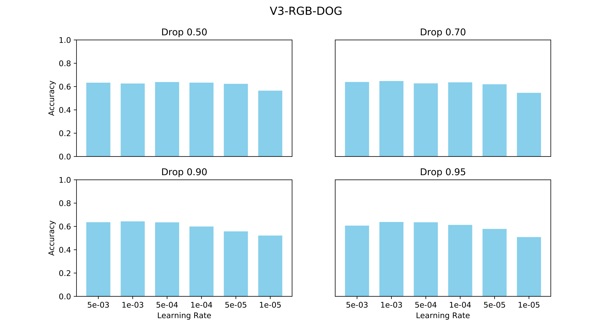
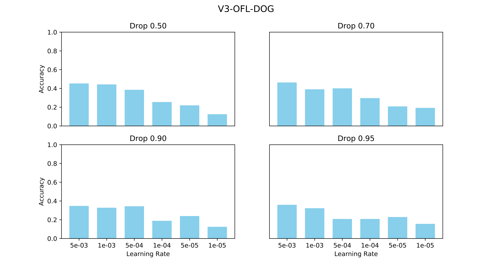
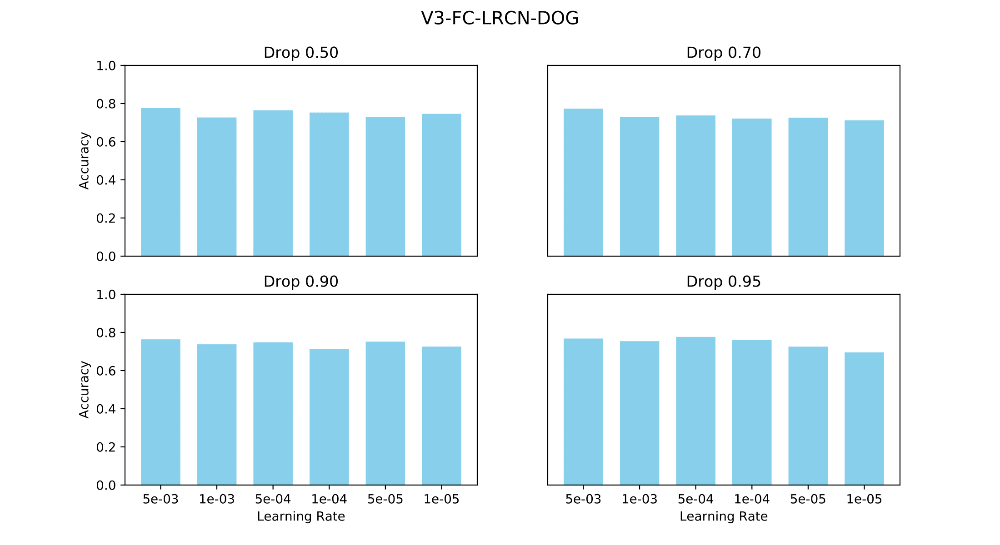
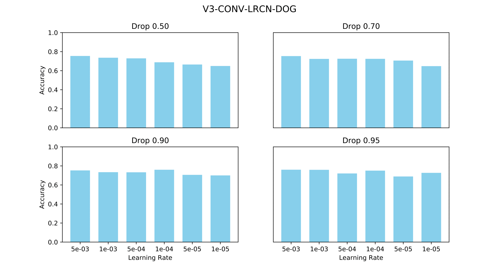
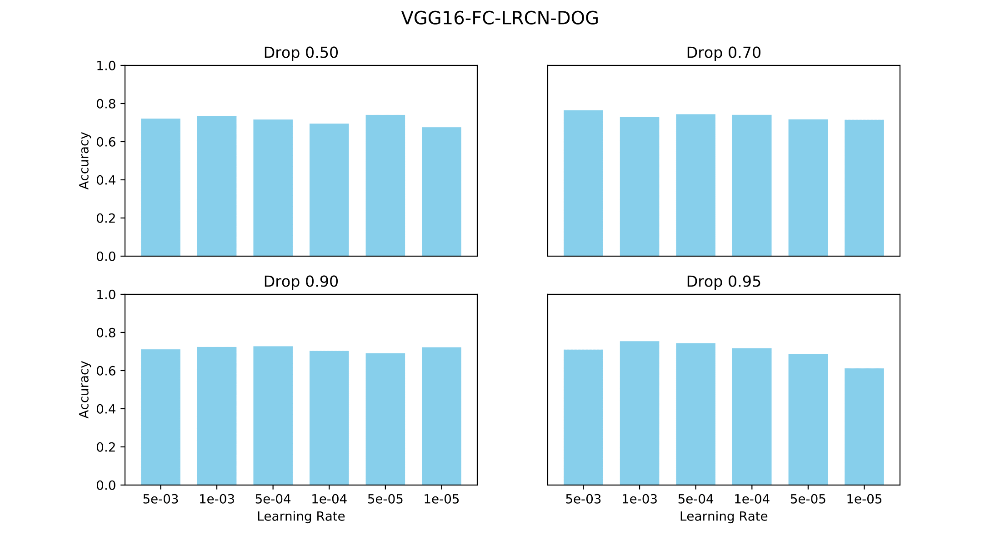
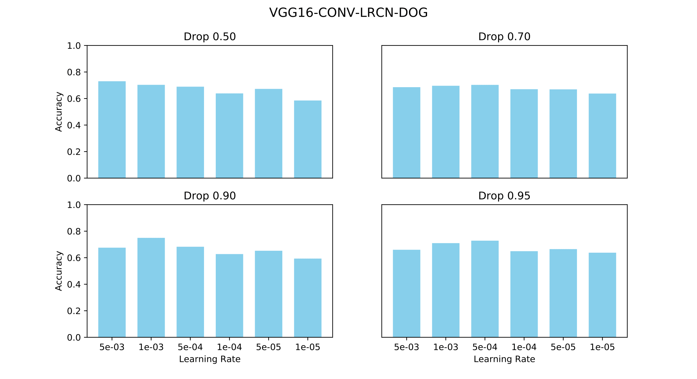

### KSCGR

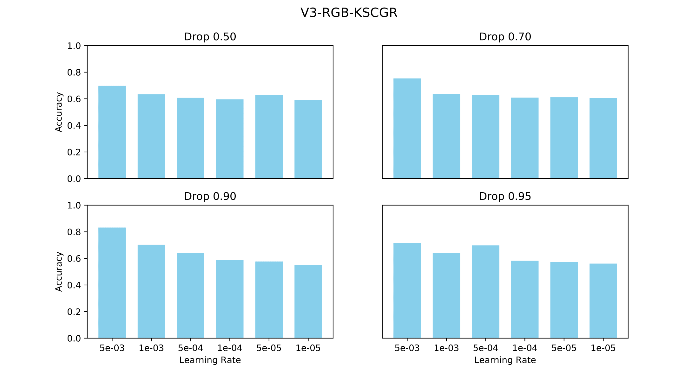
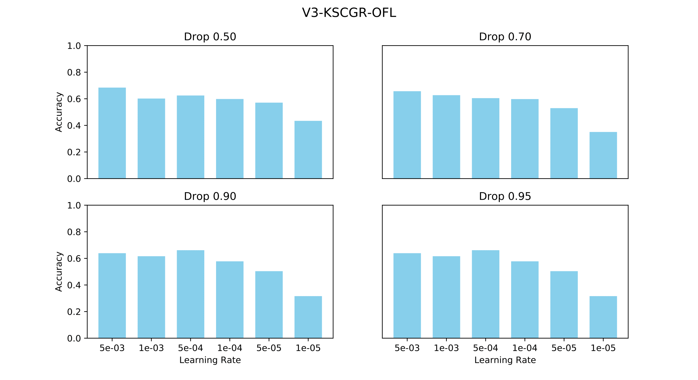
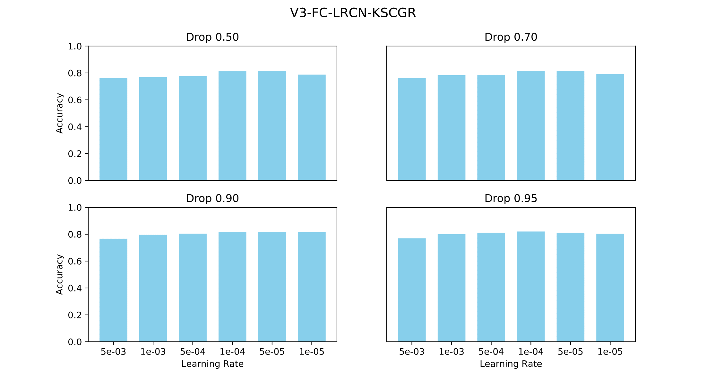
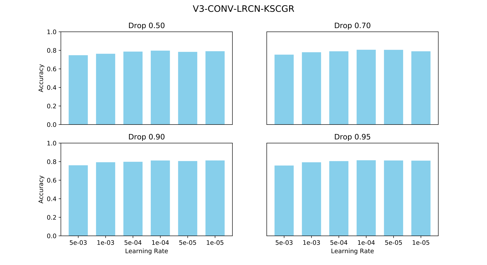
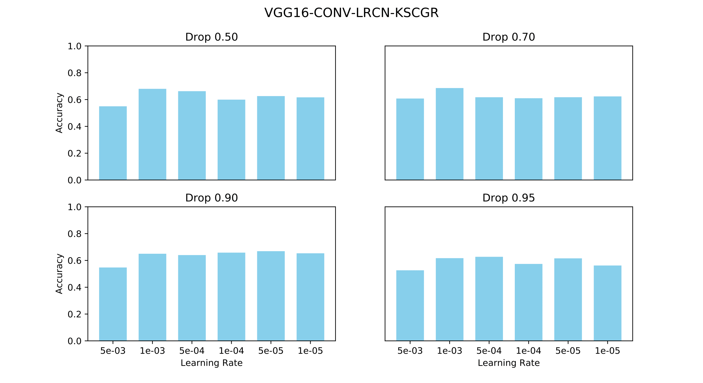

### UCF-11 

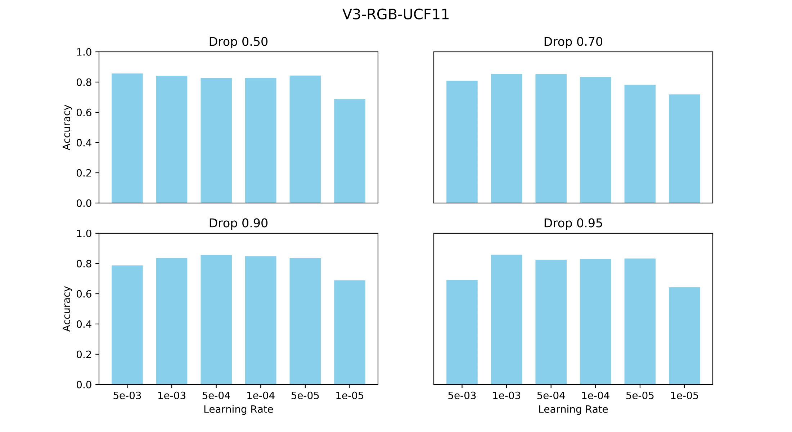
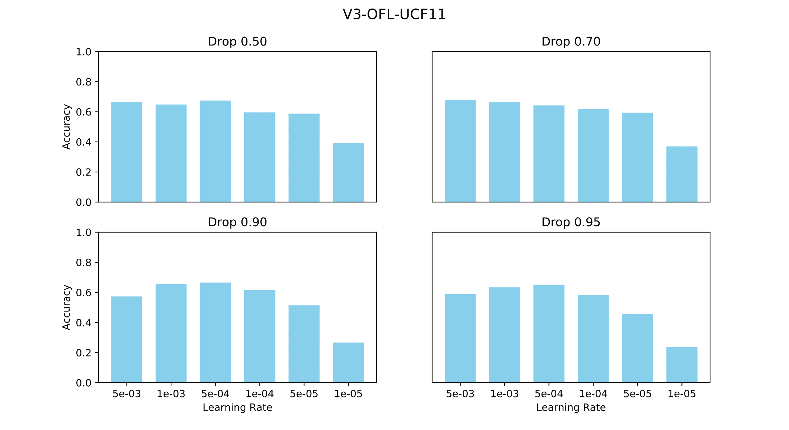
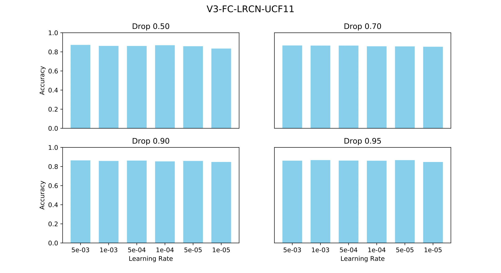

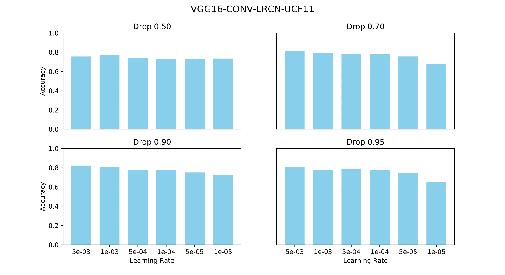


---
## How to cite

When citing our work in academic papers, please use this BibTeX entry:

```
@inproceedings{MonteiroEtAl2018,
  author    = {Monteiro, Juarez and Granada, Roger and Aires, Jo{\~a}o P and Barros, Rodrigo C},
  title     = {Evaluating the Feasibility of Deep Learning for Action Recognition in Small Datasets},
  booktitle = {Proceedings of the 2018 International Joint Conference on Neural Networks},
  series    = {IJCNN'18},
  location  = {Rio de Janeiro, Brazil},
  year      = {2018},
  publisher = {IEEE}
}
```


---
References

[1] Iwashita, Yumi and Takamine, Asamichi and Kurazume, Ryo and Ryoo, Michael S. [First-Person Animal Activity Recognition from Egocentric Videos](http://dx.doi.org/10.1109/ICPR.2014.739). Proceedings of the 22nd International Conference on Pattern Recognition (ICPR'14), Stockholm, Sweden, pp. 4310-4315, IEEE, 2014.  
[2] Shimada, Atsushi and Kondo, Kazuaki and Deguchi, Daisuke and Morin, Géraldine and Stern, Helman. [Kitchen Scene Context Based Gesture Recognition: A Contest in ICPR2012](http://dx.doi.org/10.1007/978-3-642-40303-3_18). Revised Selected and Invited Papers of the International Workshop on Advances in Depth Image Analysis and Applications - Volume 7854 (WDIA'12), Tsukuba, Japan, pp. 168-185, Springer-Verlag, 2013.  
[3] Liu, Jingen and Luo, Jiebo and Shah, Mubarak. [Recognizing Realistic Actions from Videos "in the Wild"](https://doi.org/10.1109/CVPR.2009.5206744). Proceedings of the 2009 IEEE Computer Society Conference on Computer Vision and Pattern Recognition (CVPR'09), Miami, FL, USA, pp. 1996-2003, IEEE, 2009.  
